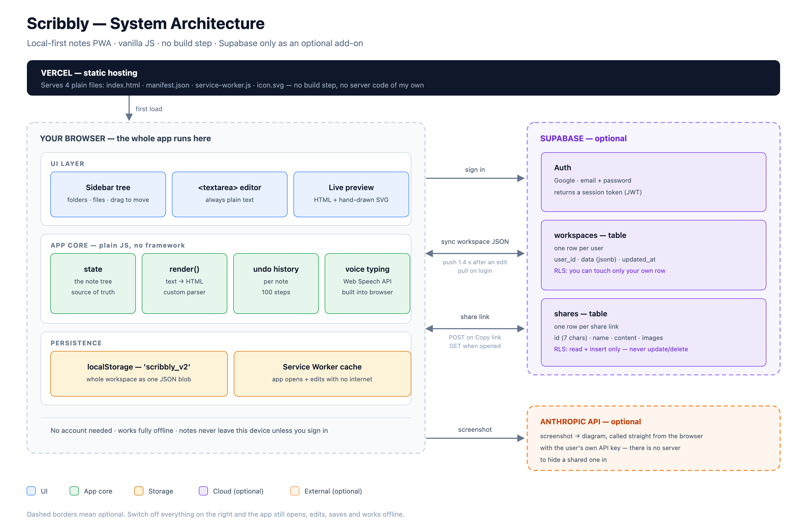
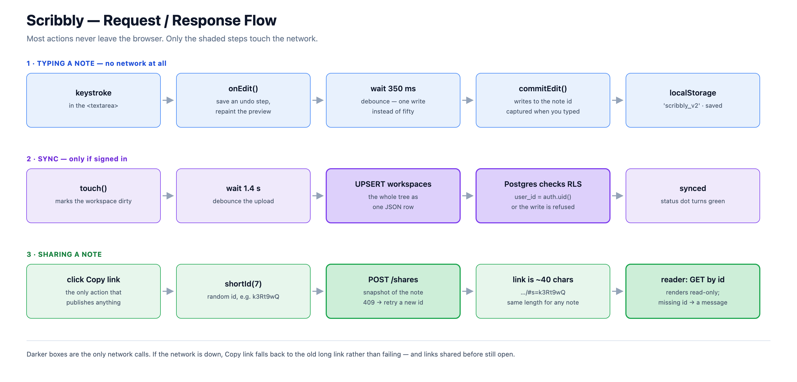

# Scribbly — Architecture

Reference for explaining this project. Every claim is taken from the code.

**What it is:** a notes app where you type plain text and it formats itself — first line
becomes the title, `ALL CAPS` becomes a heading, `A -> B -> C` becomes a hand-drawn diagram.
Works with no account and no internet. Signing in is optional and only adds sync.

---

## 1. System architecture



### What's involved

| Piece | Role |
|---|---|
| **Vercel** | Serves 4 static files. No build step, no server code. |
| **UI layer** | Sidebar tree, `<textarea>` editor, live preview. |
| **App core** | `state` (the note tree), `render()` (text → HTML), undo history, voice typing. |
| **localStorage** | The whole workspace as one JSON blob. The real source of truth. |
| **Service worker** | Caches the app so it opens and edits offline. Makes it installable. |
| **Supabase** *(optional)* | Auth + two Postgres tables + row-level security. |
| **Anthropic API** *(optional)* | Screenshot → diagram, using the user's own key. |

### The rule the design follows

> **The browser is the source of truth. The cloud is a backup.**
> Every feature must work with the network unplugged.

**Why:** no server to run or pay for, typing never waits on a network round trip, and a
guest's notes never leave their device.

**The cost:** no server means no server-side validation and no shared secrets. Acceptable
here because a user's own notes are the only asset, and Postgres row-level security is what
stops one user reading another's.

---

## 2. Request / response flow



Three things worth saying out loud about this diagram:

- **Row 1 makes no network call at all.** Typing is local. That is the whole point of
  local-first, and it's why the app feels instant.
- **Debouncing appears twice** — 350 ms before saving locally, 1.4 s before uploading. One
  write instead of fifty.
- **The debounced save captures its inputs when you type, not when the timer fires.** That
  one line is the fix for the worst bug in this project (§6.1).

---

## 3. Tech stack

| Layer | Choice | Why not the obvious alternative |
|---|---|---|
| UI | Vanilla HTML/CSS/JS, one file | React/Vue need a build step and `node_modules` for an app that is one screen |
| Editor | `<textarea>` | See §5 |
| Formatting | Custom line parser | `marked` is a dependency and still wouldn't do ALL-CAPS headings or arrow diagrams |
| Diagrams | Hand-rolled SVG, seeded PRNG | Mermaid is ~800 KB and draws clean corporate boxes; I wanted wobbly hand-drawn |
| Local storage | `localStorage` | Workspace is well under 5 MB; IndexedDB is async and far more code for no gain |
| Backend | Supabase | Postgres + auth + row-level security without writing or hosting a server. Firebase was the alternative; Supabase gives real SQL and real RLS policies |
| Offline / install | Service worker + manifest (PWA) | Installs on a phone home screen with no app store |
| Voice | Web Speech API | Built into the browser; a cloud speech API needs a server and costs per minute |
| Hosting | Vercel (static) | Nothing to deploy but files |
| Tests | Custom DOM harness | Jest/Vitest need Node and a build; this drives the real app in an iframe |

**One-line answer:** *"Vanilla JS local-first PWA, no framework and no build step, with
Supabase as an optional auth and sync backend."*

---

## 4. Database

Most of the "database" is a JSON tree in the browser. There are only two Postgres tables.

### The note tree — in `localStorage`, and inside `workspaces.data`

```js
{
  id: "root", type: "folder", name: "root",
  children: [
    { id: "abc123", type: "file",   name: "EventLoop", content: "Node Js Notes\n..." },
    { id: "def456", type: "folder", name: "Interview", children: [ /* recursive */ ] }
  ]
}
```

Recursive, because folders nest. Pasted images are **not** inline — they live in a separate
`state.images` map and the text holds only a token `img:abc123`, keeping the editor small.

### `workspaces` — cloud sync, one row per user

| Column | Type | Note |
|---|---|---|
| `user_id` | `uuid` PK | FK to `auth.users` |
| `data` | `jsonb` | whole tree + images as one blob |
| `updated_at` | `timestamptz` | drives last-write-wins |

**RLS:** one policy — you may touch only the row where `user_id = auth.uid()`.

### `shares` — one row per share link

| Column | Type | Note |
|---|---|---|
| `id` | `text` PK | the 7-character link id |
| `name`, `content` | `text` | snapshot of the note |
| `images` | `jsonb` | only the images that note uses |
| `created_at` | `timestamptz` | |

**RLS:** `select` + `insert` open; **no `update` or `delete` policy at all**, so a published
link can never be rewritten by whoever receives it.

### Why one JSON blob instead of `folders` / `notes` tables?

The app always reads and writes the *entire* workspace — it never queries "all notes in
folder X". Normalising would add joins, migrations and N queries to render one sidebar, to
support queries nobody makes. It is the first thing I'd change if the app ever needed
per-note sync or collaboration.

---

## 5. Why `<textarea>` and not the alternatives

| Option | Why not |
|---|---|
| `<input type="text">` | Single line. Disqualified immediately. |
| `contenteditable` div | You edit *HTML*, not text — you then own cursor maths, sanitising pasted rich text, and each browser's inconsistent DOM |
| Quill / Slate / TipTap | Solves that, but adds 100–300 KB and a build step to a dependency-free app |
| **`<textarea>`** ✅ | Its value is a plain string — that one property makes everything downstream simple |

**What the plain string buys:** one source of truth (saving, `.txt`/`.md` export and undo all
operate on the same thing); undo is ~20 lines (snapshot string + cursor); voice typing is a
substring splice; pasted HTML arrives as text so there's no sanitiser to get wrong; mobile
keyboards behave.

**The price — measured.** A `<textarea>` re-lays out *all* of its text on every change:

| Note size | One update costs |
|---|---|
| 11 chars | 0.04 ms |
| 3,300 chars | 4.1 ms |
| 22,000 chars | 13–18 ms |
| 77,000 chars | 52 ms |

Irrelevant while typing. It mattered for **voice typing**, where interim results arrive
~8×/second. The fix wasn't to abandon `<textarea>` — it was to measure the real cost on the
real device when dictation starts, then space updates to stay under ~12% of the main thread.

---

## 6. Problems hit, and how they were fixed

### 6.1 Clicking a file showed the previous file's text

Two independent bugs with the same symptom:

1. **A formatter crash left stale HTML on screen.** `updatePreview()` assigned
   `innerHTML = render(v)` with no guard, so any throw left the previous note's HTML in
   place. → wrapped in `try/catch` with a plain-text fallback.
2. **The debounced save wrote to the wrong note.** The 350 ms timer read `state.active` at
   *fire* time. Type, then click another note within 350 ms, and the edit landed on the
   wrong one. → capture `{id, value}` at typing time; flush before every file switch.

**Takeaway:** a debounced callback must capture its inputs when the event happens.

### 6.2 Dictating, then switching notes, overwrote the other note

Every speech result did `textarea.value = before + interim + after` using text captured when
dictation started. Switching notes didn't stop the mic, so the next result wrote the **old**
note's text into the **newly opened** note — a silent whole-file overwrite.

**Fix:** dictation is pinned to the note it began in. `openFile()` stops the mic, and the
paint step refuses to write if the active note moved.

### 6.3 Voice typing was unusably slow — and my first guess was wrong

I assumed the preview pane. Measuring showed emptying it changed things by **5%**
(14.07 ms → 13.39 ms). The real cost was the `<textarea>` re-layout in §5.

**Takeaway:** measure before optimising. The wrong fix would have shipped and changed nothing.

### 6.4 Sync could wipe your notes with an empty workspace

`pushWorkspace()` upserts the *whole* workspace, so a half-booted page could replace good
cloud data with nothing. **Fix:** refuse to push a tree containing zero files.

### 6.5 A test suite that agreed with the bug

A duplicate `commitEdit` shipped through three commits because tests called functions *by
name* — and a shadowed global resolves the same way for the test as for the bug. **Fix:** UI
paths are now driven by real DOM events (clicking actual buttons), plus a source guard that
fails on duplicate top-level functions.

### 6.6 Share links were 21,661 characters

The note was base64'd into the URL. Now it's stored once and the URL carries a 7-character
id, so a link is ~40 characters for any note size.

**Takeaway:** put an identifier in the URL, not the payload.

---

## 7. Trade-offs

| Decision | Gained | Gave up |
|---|---|---|
| No framework | Zero deps, no build | No component model; one ~1,900-line file |
| Local-first | Instant, offline, private | No real-time collaboration |
| Whole-workspace JSON blob | Simple sync, no migrations | Last-write-wins — two devices at once, one loses |
| `localStorage` | Synchronous, simple | ~5 MB ceiling |
| No backend server | Free, nothing to operate | No server-side validation or rate limiting |
| Supabase BaaS | Auth + Postgres + RLS free | Vendor lock-in; a wrong RLS policy *is* a breach |
| Browser print for PDF | Real PDFs, no 300 KB library | Needs pop-ups allowed |
| Share = unlisted link | No account needed to share | Unlisted ≠ private; a share is a snapshot, not live |
| Custom test harness | Tests the real DOM, no Node | Run by hand, no coverage report |

---

## 8. How to run it

```bash
git clone https://github.com/chetansai123/scribbly.git
cd scribbly
python3 -m http.server 8765
```

Open **http://localhost:8765**. No `npm install`, no build step.

| Task | Steps |
|---|---|
| **Run tests** | Open `http://localhost:8765/tests.html` → **Run tests**. Backs up your notes first, restores after. |
| **Deploy** | Push to `main` — Vercel builds automatically. Then bump `CACHE` in `service-worker.js` so installed phones update. |
| **Cloud setup** *(one time)* | Supabase → SQL Editor → run `supabase-setup.sql` → then **Authentication → URL Configuration** → set Site URL + Redirect URLs to your domain. |

> Skipping that last URL step is the classic failure: Supabase silently ignores an unlisted
> redirect and sends you to the old domain, so sign-in appears to never stick.

The publishable key in `index.html` is safe to commit — it is protected by RLS. The
`service_role` secret is never used in this app.

---

## 9. Thirty-second answer

> "Scribbly is a local-first notes PWA — vanilla JS, no framework, no build step, one HTML
> file. The browser is the source of truth: notes live in `localStorage` and everything works
> offline. Supabase sits on top optionally, giving Google/email auth and cross-device sync as
> one Postgres row per user, secured by row-level security. Sharing writes a snapshot to a
> `shares` table and puts a 7-character id in the URL, so a link is ~40 characters instead of
> 20,000. The interesting engineering was in the failure modes rather than the features — a
> debounced save that captured the wrong note, dictation that overwrote a file when you
> switched notes, and a test suite that agreed with the bug it should have caught."
